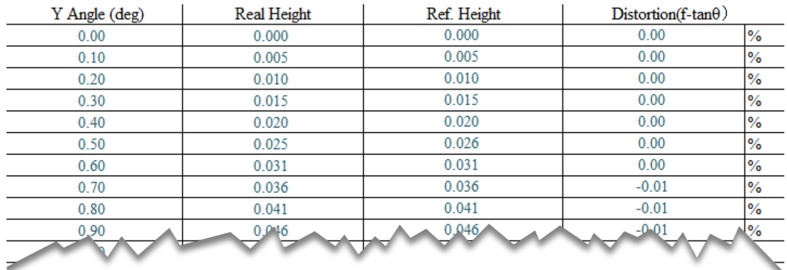

# 深入洞察OpenCV鱼眼模型之成像投影和畸变表估计系数相互转化

[](https://ww2.mathworks.cn/matlabcentral/fileexchange/118170-use-opencv-fisheye-and-distortiontable-in-matlab)
[](https://matlab.mathworks.com/open/github/v1?repo=cuixing158/OpenCVFisheyeAndDistortionTable&file=main.mlx)

>本Repo实现了从原理公式上直接使用来自OpenCV鱼眼畸变模型的4个系数$k_1 ,k_2 ,k_3 ,k_4$和内参$K$对图像进行去畸变以及来自厂商提供的镜头畸变表与OpenCV鱼眼模型参数的估计互相转换。另外对OpenCV鱼眼模型的成像原理过程(透视投影像高vs畸变像高)进行了绘图分析，便于从视觉上直观感受，从而加深对OpenCV鱼眼镜头模型投影成像的理解。关于pin-hole透视镜头成像标定过程可以参阅我之前的[Repo](https://github.com/cuixing158/singleImageCalibration)。

## Table of contents

- [Overview of Distortion Table](#overview-of-distortion-table)
- [Overview of OpenCV fisheye Camera Model](#overview-of-opencv-fisheye-camera-model)
  - [注意误点](#注意误点)
  - [总结几点](#总结几点)
- [直接根据畸变表对图像去畸变](#直接根据畸变表对图像去畸变)
- [畸变表拟合系数对图像去畸变](#畸变表拟合系数对图像去畸变)
- [畸变系数推算畸变表](#畸变系数推算畸变表)
- [References](#references)

## Overview of Distortion Table

来自鱼眼镜头厂商的畸变表一般为下述形式表格，其描述了光线通过透镜在相机传感器平面成像的高度信息，一般至少含有3列数据，比如下面表格有“Angle”(degrees),"Real Height"(mm),"Ref Height"(mm)等。其分别表示光线入射角(光线与摄像机光轴的夹角)，实际成像高度，参考成像高度(透视投影)，这些信息**足以表征此镜头的畸变扭曲程度**。另外还会提供一些常量,如每个像素长度为0.003mm，图像尺寸1920×1080，畸变中心位于图像中心，进一步地，结合畸变表，可以推算相机内参矩阵$K$。



上述表格中第1列和第3列通常满足$\textrm{RefH}=f*\tan \left(\theta \right)$,$\theta$对应第一列，一般从0°到90°之间，$\textrm{RefH}$为第三列，从此式可以推算出焦距$f$。

本Repo中所使用的畸变表格数据和此镜头录制的图像畸变数据在当前“data”文件夹下的“distortionTableFromFactory.xlsx”，“distortionImageN.png”。

## Overview of OpenCV fisheye Camera Model

关于Fish-Eye其实有多种投影模型，具体参考[文献6](https://wiki.panotools.org/Fisheye_Projection)，典型有equidistance，equisolid angle，orthogonal projection等，根据OpenCV实现，其依据的论文是一种通用模型，不依赖某个具体的类型，取9阶系数就足以满足绝大多数镜头畸变模型。在此，也不再叙述过程，本文重点在下述原理理解和代码实践上！

根据此处OpenCV官方文档此处[链接](https://docs.opencv.org/4.x/db/d58/group__calib3d__fisheye.html)，导航到“Detailed Description”部分，要完全弄清楚其原理，其描述过程仍然令人有些费解，没有像MATLAB官方文档描述的清楚，一目了然。即使结合第三方大量博客(CSDN,知乎等，见文后References)，也未必能阐述清楚。故结合OpenCV源码和论文“a generic camera model and calibration method for conventional-wide-angle and fisheye lenses”，再经过本Repo实践，我画出下面的**成像原理图，符号和公式严格表达准确，代码运行可靠!**


简单阐述下上述我绘制的图中的主要符号，坐标系$X_c O_1 Y_c$为相机物理坐标系，蓝色平面$\pi_1$为归一化成像平面(离光心$O_1$的距离为1)，橙色平面$\pi_2$为实际成像平面(离光心$O_1$的距离为焦距$f$)，点$P$为坐标系$X_c O_1 Y_c$下的一外点，光线通过红色虚线射入，从绿色虚线“折射”到成像平面“引起畸变”；点$p^{\prime }$,$N$分别为平面$\pi_2$，$\pi_1$理想透视投影点，点$p$,$M$分别为平面$\pi_2$，$\pi_1$实际投影畸变点。另外位于平面$\pi_1$的$\left\|O_2 M\right\|=r_d$，$\left\|O_2 N\right\|=r$，而不是平面$\pi_2$中的$\left\|O_3 p\right\|\not= r_d$，$\left\|O_3 p^{\prime } \right\|\not= r$,这在OpenCV文档中并没有解释清楚。

点$P\left(x_c ,y_c ,z_c \right)$透视投影经归一化为平面$\pi_1$中的点$N\left(x_n ,y_n \right)$,

$$
x_n =\frac{x_c }{z_c },y_n =\frac{y_c }{z_c }
$$

$$
r^2 =x_n^2 +y_n^2
$$

$$
\theta =\textrm{atan}\left(r\right)
$$
  
畸变像高：

$$
r_d =\theta \left(1+{k_1 \theta }^2 +k_2 \theta^4 +k_3 \theta^6 +{k_4 \theta }^8 \right)
$$

同时，$\bigtriangleup O_1 O_2 M$为直角三角形，满足，

$$
r_d =1*\tan \left(\theta_d \right)
$$

注意上述式子中的$r_d$并非OpenCV文档中写的$\theta_d$，然后计算比例因子scale,

$$
\textrm{scale}=\frac{r_d }{r}
$$

又因$\bigtriangleup O_1 O_2 N\sim \bigtriangleup O_1 O_3 p^{\prime }$,$\bigtriangleup O_1 O_2 M\sim \bigtriangleup O_1 O_3 p$,

$$则\textrm{scale}=\frac{r_d }{r}=\frac{\left\|O_3 p\right\|}{\left\|O_3 p^{\prime } \right\|}$$

为了得到点$p$的畸变坐标$\left(x_d ,y_d \right)$,有，

$$
x_d =\textrm{scale}*a
$$

$$
y_d =\textrm{scale}*b
$$

设点$O_3$在像素平面$\textrm{uv}$下的坐标为$\left(U_0 ,V_0 \right)$,在$x$轴，$y$轴单位长度上的像素数为$f_x ,f_y$,则像素坐标为，

$$
u=f_x *x_d +U_0
$$

$$
v=f_y *y_d +V_0
$$

如果考虑错切因子$\alpha$,则上式$\left.u=f_x *{\left(x\right.}_d +{\alpha y}_d \right)+U_0$，此时内参矩阵$K$即为，

$$
K=\left\lbrack \begin{array}{ccc}
f_x  & \alpha  & U_0 \\
0 & f_y  & V_0 \\
0 & 0 & 1
\end{array}\right\rbrack
$$

注意上述步骤其实是**图像去畸变的工作过程，先一一找到无畸变点对应的畸变点坐标映射，合适时候再通过插值找到对应的像素点。**

如果是**某个点的去畸变，则需要逆向求解上述过程**，其中有已知$\theta_d$，求$\theta$，这就很多方法了，不在此描述。

### 注意误点

- $r_d$，$r$的计算分析均指在归一化平面$\pi_1$上进行的，而不是实际成像平面$\pi_2$。[OpenCV文档](https://docs.opencv.org/4.x/db/d58/group__calib3d__fisheye.html)中写的是$\theta_d =\theta \left(1+{k_1 \theta }^2 +k_2 \theta^4 +k_3 \theta^6 +{k_4 \theta }^8 \right)$不准确的，并非上述公式中的$\theta_d$，这是因为OpenCV源码变量中把$r_d$中间临时变量写成了$\theta_d$，而文档是根据代码自动生成的，这就导致了描述不够准确，但内部计算逻辑是正确的，$\theta$和$\theta_d$单位为弧度，非度数。
- 参考[文献4](https://blog.csdn.net/qq_16137569/article/details/112398976)描述“畸变与焦距无关”是不完全正确的，这在归一化成像平面$\pi_1$上成立，因为有$r_d =1*\tan \left(\theta_d \right)$，但在实际成像平面上$\pi_2$上不成立，因为$\left\|O_3 p\right\|=f*\tan \left(\theta_d \right)$,$\theta_d$一定的情况下，与焦距$f$成正比的。
- 参考[文献4](https://blog.csdn.net/qq_16137569/article/details/112398976)把平面$\pi_1$和平面$\pi_2$混为一团，后果是牵强认为$r_d =1*\tan \left(\theta_d \right)=\theta_d$，为了说服其成立，认为“$\theta_d$趋于0，$r_d$就等于$\theta_d$”，但这里根本就没有趋向于0的说法。

### 总结几点

- 归一化平面$\pi_1$存在的目的是为了求取尺度scale，然后根据三角形相似原理转嫁到实际成像平面$\pi_2$做去畸变计算。
- 焦距不会影响畸变形状（或外观），影响的是尺度变化，但尺度变化百分比保持不变。
- 4个畸变系数$k_1 ,k_2 ,k_3 ,k_4$影响畸变形状（或外观），也会影响尺度大小。
- 内参矩阵$K$是相机物理坐标与像平面像素坐标互相转换的“过渡矩阵”，决定着畸变中心位置坐标和坐标系转换的功能。

为了利用畸变表提供的数据对畸变图像进行去畸变，通常有下面2种方式：


下面对上述2种方式分别进行实现。

## 直接根据畸变表对图像去畸变

主要利用畸变表中像高比例进行查表(一维插值)进行畸变量计算，算法步骤为：

   1. 根据畸变表估算内参矩阵$K$和人为指定无畸变图大小；
   1. 利用内参矩阵$K$对某个无畸变图像素坐标$\left(u,v\right)$转为像平面$\pi_2$的物理坐标$\left(x,y\right)$；
   1. 计算物理坐标$\left(x,y\right)$离原点的距离为RefH；
   1. 计算入射角$\theta$，然后查表得到畸变像高距离$r_d$,直接根据比例计算物理畸变点坐标$\left(x_d ,y_d \right)$；
   1. 再次利用内参矩阵$K$将物理畸变点坐标$\left(x_d ,y_d \right)$转为像素坐标$\left(u_d ,v_d \right)$；
   1. 对所有无畸变图上的点重复step2-5找到像素坐标映射关系$\left(u,v\right)\to \left(u_d ,v_d \right)$,最后图像插值即可完成去畸变。

读取畸变视频/图像源

```matlab
distortFrame = imread("data/distortionImage1.png");
figure;imshow(distortFrame);
title("distortion image")
```


```matlab

distortionTablePath = "./data/distortionTable.xlsx";
sensorRatio = 0.003;% 由厂家提供，单位 mm/pixel

cameraData = readtable(distortionTablePath,Range="A4:D804",VariableNamingRule="preserve");
head(cameraData)% 预览前面若干行数据
```

```text
    Y Angle (deg)    Real Height    Ref. Height    Distortion(f-tanθ)
    _____________    ___________    ___________    ___________________
         0.1          0.0050939      0.005103          -0.00011259    
         0.2           0.010188      0.010207          -0.00048478    
         0.3           0.015282       0.01531           -0.0011181    
         0.4           0.020376      0.020414           -0.0020122    
         0.5           0.025469      0.025518           -0.0031675    
         0.6           0.030563      0.030622           -0.0045836    
         0.7           0.035657      0.035726           -0.0062606    
         0.8           0.040751       0.04083           -0.0081985    
```

第一列为入射角，第二列为实际畸变量长度,单位：mm，第三列为理想参考投影长度，单位：mm.

```matlab
angleIn = cameraData{:,1};% 入射角
focal = mean(cameraData{:,3}./tand(angleIn));% 焦距，单位:mm
angleOut = atan2d(cameraData{:,2},focal);% 出射角
cameraDataIn = table(angleIn,angleOut,VariableNames = ["angle","angle_d"]);
[h,w,~] = size(distortFrame);

K = [focal/sensorRatio,0,w/2;
    0,focal/sensorRatio,h/2;
    0,0,1];
undistortImg  = undistortFisheyeImgFromTable(distortFrame,K,cameraDataIn,OutputView="same");
figure;
imshow(undistortImg);
title("undistortion image from distortion table directly")
```


## 畸变表拟合系数对图像去畸变

先对畸变表中的像高按照归一化平面$\pi_1$进行像高的转换，然后根据畸变公式进行系数拟合，最后根据比例进行查表(一维插值)进行畸变量计算，算法步骤为：

   1. 根据畸变表数据(实际焦距$f$下的像高)换算为归一化平面$\pi_1$的像高；
   1. 按照畸变公式进行系数拟合得到$k_1 ~k_4$,同时估算内参矩阵$K$和人为指定无畸变图大小;
   1. 利用内参矩阵$K$对某个无畸变图像素坐标$\left(u,v\right)$转为像平面$\pi_1$的物理坐标$\left(x,y\right)$；
   1. 计算物理坐标$\left(x,y\right)$离原点的距离为RefH；
   1. 计算入射角$\theta$，然后根据畸变公式得到畸变像高距离$r_d$,随后根据比例计算物理畸变点坐标$\left(x_d ,y_d \right)$；
   1. 再次利用内参矩阵$K$将物理畸变点坐标$\left(x_d ,y_d \right)$转为像素坐标$\left(u_d ,v_d \right)$；
   1. 对所有无畸变图上的点重复step2-5找到像素坐标映射关系$\left(u,v\right)\to \left(u_d ,v_d \right)$,最后图像插值即可完成去畸变。

```matlab
r_d = 1./focal*cameraData{:,2};% 求归一化平面上的r_d
thetaRadian = deg2rad(angleIn);% 度数转为弧度
```

由前面分析的畸变像高公式，对归一化平面$\pi_1$上每一个入射角$\theta \left(\theta_1 ,\theta_2 ,\cdots ,\theta_n \right)$，有下述等式成立，

$$
\left\lbrace \begin{array}{l}
\theta_1 +k_1 \theta_1^3 +k_2 \theta_1^5 +k_3 \theta_1^7 +k_4 \theta_1^9 =r_{\textrm{d1}} \\
\theta_2 +k_1 \theta_2^3 +k_2 \theta_2^5 +k_3 \theta_2^7 +k_4 \theta_2^9 =r_{\textrm{d2}} \\
\vdots \\
\theta_n +k_1 \theta_n^3 +k_2 \theta_n^5 +k_3 \theta_n^7 +k_4 \theta_n^9 =r_{\textrm{dn}}
\end{array}\right.
$$

写为矩阵形式，为，

$$
\left\lbrack \begin{array}{cccc}
\theta_1^3  & \theta_1^5  & \theta_1^7  & \theta_1^9 \\
\theta_2^3  & \theta_2^5  & \theta_2^7  & \theta_2^9 \\
\vdots  & \vdots  & \vdots  & \vdots \\
\theta_n^3  & \theta_n^5  & \theta_n^7  & \theta_n^9
\end{array}\right\rbrack *\left\lbrack \begin{array}{c}
k_1 \\
k_2 \\
k_3 \\
k_4
\end{array}\right\rbrack =\left\lbrack \begin{array}{c}
r_{\textrm{d1}} -\theta_1 \\
r_{\textrm{d2}} -\theta_2 \\
\vdots \\
r_{\textrm{dn}} -\theta_n
\end{array}\right\rbrack
$$

典型为$A*x=b$,最小二乘解为$x=A\backslash b$.

```matlab
A = [thetaRadian.^3,thetaRadian.^5,thetaRadian.^7,thetaRadian.^9];
b = r_d-thetaRadian;
opencvCoeffs = A\b;
disp("最小二乘拟合OpenCV鱼眼模型畸变系数为(k1~k4)："+strjoin(string(opencvCoeffs'),","))
```

```text
最小二乘拟合OpenCV鱼眼模型畸变系数为(k1~k4)：-0.10493,0.015032,-0.013603,0.0030601
```

```matlab
newCameraMatrixK = K;
newImageSize = size(distortFrame,[1,2]);% [height,width]
[mapX,mapY] = initUndistortRectifyMapOpenCV(K, opencvCoeffs,newCameraMatrixK,newImageSize);
```

mapX,mapY即为映射$\left(u,v\right)\to \left(u_d ,v_d \right)$的关系坐标。

```matlab
undistortImg2 = images.internal.interp2d(distortFrame,mapX,mapY,"linear",255, false);
figure;
imshow(undistortImg2)
title("undistortion image from fit opencv fisheye model coefficient")
```


可以看出两种方法效果图一致，主要区别就是尺度scale计算方式不同，一个是直接查表得到scale，另一个是拟合公式求scale，没有明显的本质区别。

## 畸变系数推算畸变表

有时厂商提供了镜头畸变表，并且我们也通过OpenCV标定了该镜头得到内参矩阵$K$和畸变系数$k_1 ~k_4$，但我们**更想验证我们的标定算法与厂商提供的畸变表“差距”有多大，那也可以通过畸变系数推算畸变表，然后绘制像高曲线进行比对，从而确保双向验证参数的准确性和一致性。**

为实验方便，直接采用上节拟合的畸变系数$k_1 ~k_4$和估计的内参矩阵$K$作为我们的“标定参数”结果，反推上述的畸变表cameraData数据，注意这里已知$\theta$，求像高。

```matlab
disp("标定内参矩阵K：");
```

```text
标定内参矩阵K：
```

```matlab
disp(newCameraMatrixK);
```

```text
  974.6782         0  960.0000
         0  974.6782  540.0000
         0         0    1.0000
```

```matlab
disp("标定的畸变系数为(k1~k4)："+strjoin(string(opencvCoeffs'),","))
```

```text
标定的畸变系数为(k1~k4)：-0.10493,0.015032,-0.013603,0.0030601
```

```matlab
% 入射角是从0.1°逐渐变化到90°，转为弧度制
theta = deg2rad(angleIn);
RefX = tan(theta);
RefX = filloutliers(RefX,"nearest","mean");% 过滤填充异常点，tan90接近无限大
RefY = 0;
RefH = abs(RefX).*sign(tan(theta)); % 单位:mm

% 再计算拟合像高
r_d = theta.*(1+opencvCoeffs(1)*theta.^2+opencvCoeffs(2)*theta.^4+...
    opencvCoeffs(3)*theta.^6+opencvCoeffs(4)*theta.^8);

scale = r_d./RefH;
RealX = RefX.*scale;
RealY = RefY.*scale;
r_d = sqrt(RealX.^2+RealY.^2);

% 绘制参考像高vs实际像高vs百分比误差
figure;
plot(rad2deg(theta),RefH,...
    rad2deg(theta),r_d,...
    rad2deg(theta),(r_d-RefH)./RefH*100,...
    LineWidth=2)
hold on;grid on;

plot(cameraData{:,1},cameraData{:,3},"--",... % Ref height
    cameraData{:,1},cameraData{:,2},":",... % Real height
    cameraData{:,1},(cameraData{:,2}-cameraData{:,3})./cameraData{:,3}*100,"-.",...
    LineWidth=2)

f = mean([newCameraMatrixK(1,1),newCameraMatrixK(2,2)])*sensorRatio;
legend(["paraxial height(mm),f=1","real height(mm),f=1","DISTORTION(%),f=1",...
    "factory paraxial height(mm),f="+string(f),"factory real height(mm),f="+string(f),...
    "factory DISTORTION(%),f="+string(f)],Location="northwest");
ax = gca;
ax.YLim = [-50,50];
ax.XAxis.TickLabelFormat = '%g\x00B0';% 'degrees'
xlabel("入射角\theta");
ylabel("像高/百分比");
title("distortion curve(f=1 vs f="+string(mean(f))+")");
```


实线为推算的像高曲线与厂商提供畸变表像高曲线(虚线)不重合？

Oops！原来是在不同成像平面上像高差异导致的(就是最上面分析的平面$\pi_1$，$\pi_2$)，他们的畸变百分比是一致的！再看下下面焦距弥补导致的像高曲线变化。

```matlab
% 转换到实际f的焦距成像平面上的像高
RefH = f.*RefH;
r_d = f.*r_d;

% 绘制厂商结果对比图
figure;
plot(rad2deg(theta),RefH,...
    rad2deg(theta),r_d,...
    rad2deg(theta),(r_d-RefH)./RefH*100,...
    LineWidth=2)
hold on;grid on;

plot(cameraData{:,1},cameraData{:,3},"--",... % Ref height
    cameraData{:,1},cameraData{:,2},":",... % Real height
    cameraData{:,1},(cameraData{:,2}-cameraData{:,3})./cameraData{:,3}*100,"-.",...
    LineWidth=2)
legend(["paraxial height(mm),f="+string(f),"real height(mm),f="+string(f),"DISTORTION(%),f="+string(f),...
    "factory paraxial height(mm),f="+string(f),"factory real height(mm),f="+string(f),...
    "factory DISTORTION(%),f="+string(f)],Location="northwest");
ax = gca;
ax.YLim = [-50,50];
ax.XAxis.TickLabelFormat = '%g\x00B0';% 'degrees'
xlabel("入射角\theta");
ylabel("像高/百分比");
title("distortion curve");
```


```matlab
writematrix([rad2deg(theta),r_d,RefH],"backupDistortionTable.xlsx")
```

现在为实际焦距$f$下的成像像高，符合预期期望。

## References

   1. [Fisheye camera model](https://docs.opencv.org/4.4.0/db/d58/group__calib3d__fisheye.html)
   1. Juho Kannala and Sami Brandt. A generic camera model and calibration method for conventional, wide-angle, and fish-eye lenses. *IEEE transactions on pattern analysis and machine intelligence*, 28:1335–40, 09 2006.
   1. [常用相机投影及畸变模型（针孔|广角|鱼眼）](https://blog.csdn.net/qq_28087491/article/details/107965151)
   1. [鱼眼镜头的成像原理到畸变矫正（完整版）](https://blog.csdn.net/qq_16137569/article/details/112398976)
   1. [What are the main references to the fish-eye camera model in OpenCV3.0.0dev?](https://stackoverflow.com/questions/31089265/what-are-the-main-references-to-the-fish-eye-camera-model-in-opencv3-0-0dev)
   1. [Fisheye Projection](https://wiki.panotools.org/Fisheye_Projection)
